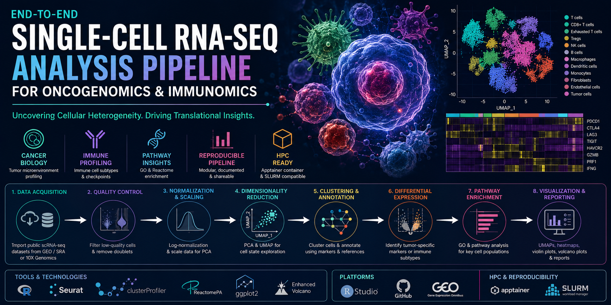

<p align="center">
  
</p>

# Single-Cell RNA-Seq Pipeline for Oncogenomics and Immunomics

> End-to-end single-cell transcriptomics workflow for tumor microenvironment analysis, immune profiling, and translational cancer bioinformatics.
Production-ready and reproducible single-cell RNA-seq analysis pipeline for oncogenomics and immunomics, including QC, clustering, cell-type annotation, differential expression, pathway enrichment, tumor microenvironment profiling, and translational bioinformatics workflows.

<p align="center">


</p>

---


# Overview

This project presents a scalable and reproducible single-cell RNA sequencing (scRNA-seq) analysis pipeline developed for applications in:

- Oncogenomics
- Immunomics
- Tumor microenvironment profiling
- Translational precision medicine

The workflow integrates state-of-the-art single-cell bioinformatics tools for:

- Cell clustering
- Immune cell annotation
- Differential expression analysis
- Pathway enrichment
- Tumor ecosystem characterization

The project was also designed as a hands-on educational framework for training students in:

- Cancer biology
- Single-cell informatics
- Immunotherapy research
- Reproducible computational biology

---

# Key Features

- End-to-end scRNA-seq workflow from raw matrices to biological interpretation
- Tumor microenvironment characterization
- Immune cell subtype annotation
- Differential expression analysis across tumor and immune populations
- Pathway enrichment using GO and Reactome
- High-quality visualization pipeline
- Modular and reproducible workflow architecture
- HPC-ready SLURM and Apptainer compatibility
- Educational pipeline with integrated tutorials and reproducible exercises

---

# Research Applications

This pipeline supports:

- Cancer systems biology
- Tumor microenvironment analysis
- Immunotherapy response profiling
- Biomarker discovery
- Precision oncology
- Translational bioinformatics
- Single-cell atlas generation

---

# Data Sources

| Source | Description |
|---|---|
| GEO | Public cancer scRNA-seq datasets |
| SRA | Sequencing repositories |
| 10X Genomics | Single-cell expression matrices |
| Tumor Cohorts | Breast cancer, melanoma, and immune microenvironment datasets |

---

# Pipeline Architecture

## Workflow Overview

```text
Raw scRNA-seq Data
        ↓
Quality Control
        ↓
Normalization & Scaling
        ↓
Dimensionality Reduction
        ↓
Cell Clustering
        ↓
Cell-Type Annotation
        ↓
Differential Expression
        ↓
Pathway Enrichment
        ↓
Biological Interpretation
        ↓
Visualization & Reporting
```

---

# Methodology

## 1. Data Acquisition

Imported publicly available scRNA-seq datasets from:

- GEO
- SRA
- 10X Genomics

### Tools
- `GEOquery`
- `Seurat::Read10X`

---

## 2. Quality Control

Performed filtering to remove:

- Low-quality cells
- High mitochondrial-content cells
- Doublets

### Tools
- `Seurat`
- `DoubletFinder`

---

## 3. Normalization & Scaling

- Log-normalized expression matrices
- Scaled highly variable genes
- Prepared data for PCA and clustering

### Tools
- `Seurat`

---

## 4. Dimensionality Reduction

Applied:

- Principal Component Analysis (PCA)
- UMAP visualization

to explore transcriptional heterogeneity and cellular states.

### Tools
- `Seurat`

---

## 5. Clustering & Cell Annotation

Identified major tumor and immune cell populations using:

- Marker genes
- Reference-based annotation
- Manual curation

### Annotation Tools
- `SingleR`
- `celltypist`
- Manual annotation workflows

---

## 6. Differential Expression Analysis

Performed cluster-level and condition-specific differential expression analysis to identify:

- Tumor-associated markers
- Immune activation signatures
- Exhausted T-cell phenotypes

### Tools
- `FindMarkers`
- `DESeq2`

---

## 7. Pathway Enrichment Analysis

Performed pathway enrichment analysis on significant gene sets using:

- Gene Ontology (GO)
- Reactome pathways
- Immune signaling pathways

### Tools
- `clusterProfiler`
- `ReactomePA`

---

## 8. Visualization & Reporting

Generated publication-quality visualizations including:

- UMAP embeddings
- Heatmaps
- Violin plots
- Volcano plots
- Cluster marker visualizations

### Tools
- `ggplot2`
- `ComplexHeatmap`
- `EnhancedVolcano`

---

# Results

## Dataset Summary

| Metric | Value |
|---|---|
| Total Cells Processed | ~82,000 cells |
| Cancer Types Analyzed | Breast Cancer, Melanoma |
| Cell Populations Identified | 18 major cell subtypes |
| Highly Variable Genes | ~2,500 |
| Differentially Expressed Genes | >4,000 significant markers |

---

# Tumor Microenvironment Mapping

Successfully characterized:

- Tumor epithelial populations
- CD8+ exhausted T cells
- Regulatory T cells (Tregs)
- Macrophage subpopulations
- Dendritic cells
- NK cells
- Stromal and fibroblast populations

---

# Immunotherapy Insights

Identified elevated expression of immune checkpoint markers in exhausted T-cell clusters:

| Marker | Biological Relevance |
|---|---|
| PDCD1 (PD-1) | T-cell exhaustion |
| CTLA4 | Immune suppression |
| LAG3 | Chronic T-cell activation |
| TIGIT | Immune inhibitory signaling |

---

# Pathway-Level Findings

## Significantly Enriched Pathways

| Pathway | Adjusted p-value |
|---|---|
| PI3K-AKT Signaling | 1.8e-06 |
| IFN-γ Response | 3.2e-05 |
| TNF Signaling | 7.1e-05 |
| T-cell Activation | 1.1e-04 |
| Hypoxia Response | 2.6e-04 |

---

# Biological Insights

- Revealed transcriptional heterogeneity within tumor microenvironments
- Identified immune exhaustion signatures associated with immunosuppressive states
- Characterized oncogenic signaling differences across tumor populations
- Demonstrated reproducible immune cell annotation workflows for translational research

---

# Tech Stack

## Programming Languages

- R
- Bash

---

## Core Bioinformatics Libraries

- Seurat
- clusterProfiler
- ReactomePA
- EnhancedVolcano
- ggplot2
- ComplexHeatmap
- SingleR
- DESeq2

---

## Infrastructure & Platforms

- RStudio
- GitHub
- Explorer HPC
- Apptainer
- SLURM clusters

---

# Repository Structure

```text
├── data/
├── notebooks/
├── scripts/
├── results/
├── figures/
├── reports/
├── logs/
├── containers/
├── README.md
└── environment.yml
```

---

# Reproducibility & Engineering Practices

- Fully modularized analysis pipeline
- Version-controlled workflows
- Automated logging and checkpointing
- HPC-ready execution
- Containerized computational environment
- Reproducible downstream analysis and visualization

---

# Educational Integration

This project doubles as a practical teaching framework for students in:

- Cancer biology
- Immunotherapy mechanisms
- Single-cell transcriptomics
- Computational biology
- Reproducible research practices

Each module includes integrated tutorials and guided exercises for hands-on learning.

---

# Future Directions

- Integration with spatial transcriptomics
- Multi-omics fusion:
  - scRNA-seq + scATAC-seq
  - proteomics integration
- Clinical biomarker discovery
- Longitudinal tumor evolution analysis
- AI-assisted cell-state annotation
- Large-scale atlas generation

---

# Applications

This framework is applicable to:

- Precision oncology
- Cancer immunotherapy research
- Translational bioinformatics
- Biomarker discovery
- Single-cell systems biology
- Computational immunology
- Clinical genomics workflows

---

# Citation

```bibtex
@misc{atallah_scrnaseq_pipeline_2026,
  author = {Atallah, Nabil},
  title = {Single-Cell RNA-Seq Pipeline for Oncogenomics and Immunomics},
  year = {2026},
  publisher = {GitHub},
  journal = {GitHub Repository}
}
```

---

# Author

## Nabil Atallah, Ph.D

Computational Biology | Single-Cell Bioinformatics | AI in Healthcare | Precision Oncology

📧 Nabilatallah@hotmail.com

---

# License

This project is licensed under the MIT License.
